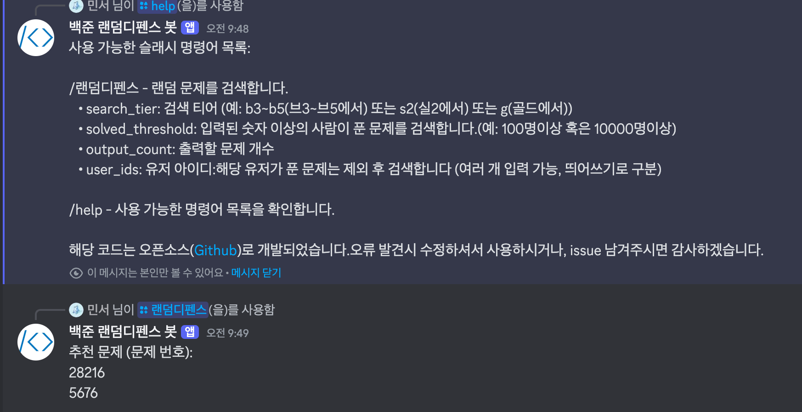

# BOJRandomDefense-Bot

**BOJRandomDefense-Bot**은 solved.ac API를 활용하여 백준 문제 중에서 특정 조건(검색 티어, 풀린 사람 수 등)에 맞는 랜덤 문제를 검색하고, 지정한 유저들이 이미 푼 문제를 제외한 추천 문제를 제공하는 Discord 봇입니다.
[간단하게 사용하기](https://discord.com/oauth2/authorize?client_id=1355689740942446652&permissions=67584&integration_type=0&scope=bot+applications.commands)

## 주요 기능

### 랜덤 문제 검색
이 봇은 사용자가 지정한 문제 난이도 범위(예: `b3~b5`(브론즈3~5), `s2`(실버2), `g`(골드))와 입력된 숫자이상의 사람이 푼 문제(예: `1000`(천명이상이 푼 문제) 혹은 `10000`(만명이상이 푼 문제))를 solved.ac API에서 랜덤 문제를 검색합니다.

### 유저별 문제 필터링
입력한 여러 solved.ac 유저의 푼 문제 목록을 가져와서, 랜덤으로 검색된 문제 중 해당 유저들이 풀지 않은 문제만 추천합니다.

### 명령어
Discord의 슬래시 명령어(`/랜덤디펜스`, `/help`)를 통해 봇 기능을 사용할 수 있습니다.

## 구조

```
.
├── bot.py           # Discord 봇 명령어와 실행 로직
├── utils.py         # solved.ac API 관련 함수 (랜덤 문제 검색, 유저 푼 문제 조회 등)
└── api_test.py      # API 쿼리 테스트용 스크립트
```

## 실행 방법

### Docker로 실행(Recommended)

1. **Docker 이미지 빌드**

   ```bash
   docker build -t random-defense-bot .
   ```

2. **환경변수 파일 (.env) 준비**

   프로젝트 루트에 `.env` 파일을 만들고 토큰을 설정합니다.


3. **Docker 컨테이너 실행**

   `.env` 파일을 컨테이너에 전달하면서 detached 모드로 실행합니다

   ```bash
   docker run -d --env-file=.env --name BOJ_rd_bot_prod random-defense-bot
   ```


### 로컬 실행

1. **의존성 설치**

   Poetry를 사용하는 경우, 프로젝트 루트에서 다음 명령어로 의존성을 설치합니다:

   ```bash
   poetry install
   ```

2. **환경변수 설정**

   Discord 개발자 포털에서 발급받은 봇 토큰을 환경변수로 설정합니다.  
   터미널에서 직접 설정하거나, 프로젝트 루트에 `.env` 파일을 생성하여 사용합니다.

   **터미널에서 직접 설정하는 방법 (Linux/macOS):**

   ```bash
   export DISCORD_TOKEN=your_actual_bot_token_here
   poetry run python bot.py
   ```

   **.env 파일 사용 시 (.env 파일 예시):**

   ```dotenv
   DISCORD_TOKEN=your_actual_bot_token_here
   ```

   그리고 `bot.py` 상단에 다음 코드를 추가하여 `.env` 파일을 로드합니다:

   ```python
   from dotenv import load_dotenv
   load_dotenv()
   ```

3. **봇 실행 및 종료**

   ```bash
   poetry run python bot.py
   ```


## 사용 방법

봇이 정상적으로 실행되면 아래 명령어를 사용할 수 있습니다

- **/랜덤디펜스**

  **설명:**  
  solved.ac API를 이용해 조건에 맞는 랜덤 문제를 검색한 후, 지정된 유저들이 풀지 않은 문제를 추천합니다.

  **인자:**
  - `search_tier`: 검색 티어 (예: `b3~b5`, `s2`)
  - `solved_threshold`: 푼 사람수 기준 (예: `10000`)
  - `output_count`: 출력할 문제 개수
  - `user_ids`: 유저 아이디 (여러 개 입력 가능, 띄어쓰기로 구분)

- **/help**

  **설명:**  
  사용 가능한 명령어 목록과 각 명령어의 설명을 제공합니다.
